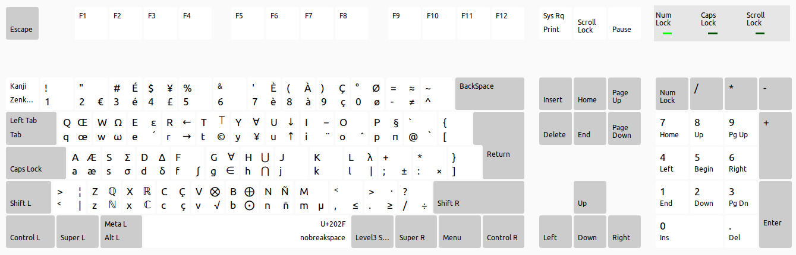

# FrenchOnJPKB
This repo hold config files to modify the French keyboard layout to make it support the Japanese keyboard. It is inspired by the available characters on Mac keyboards for scientific writing. Pull requests are welcomed to better fit everyone's need.



## Install
You need the `sudo` priviledge to continue.

- Go to `/usr/share/X11/xkb/symbols`
- Save the `fr` file
- Copy the new `fr` file in the directory
- Save the `evdev.xml` file
- Copy the new `evdev.xml` file in the directory

```bash
sudo cp /usr/share/X11/xkb/symbols/fr /usr/share/X11/xkb/symbols/fr_bak
sudo cp /usr/share/X11/xkb/rules/evdev.xml /usr/share/X11/xkb/rules/evdev_bak.xml
sudo cp ./fr /usr/share/X11/xkb/symbols/fr
sudo cp ./evdev.xml /usr/share/X11/xkb/rules/evdev.xml
```

### IBus
I modified the file `simple.xml` in `/usr/share/ibus/component/simple.xml`. 

## Transform the Henkan Mode Key into the Right Alt Key

Install the [input-remapper](https://github.com/sezanzeb/input-remapper) tool:
```bash
sudo apt update && sudo apt install input-remapper
```

Change the Henkan Mode key to `KEY_RIGHTALT`

Apply the settings.

(Source [remap keys ubuntu 22.04](https://fostips.com/remap-keys-ubuntu-22-04/))
